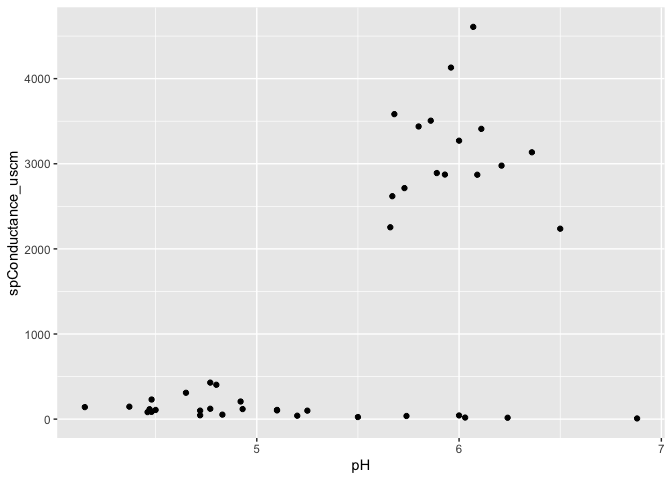
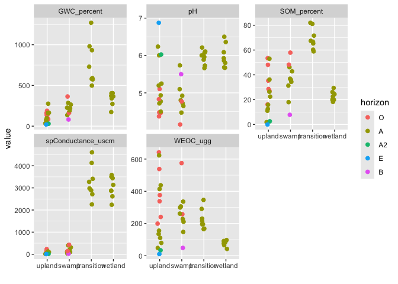

---
engines:
- path: /Applications/RStudio.app/Contents/Resources/app/quarto/share/extension-subtrees/julia-engine/\_extensions/julia-engine/julia-engine.js
execute:
  cache: false
  echo: false
  error: true
  freeze: auto
  warning: false
title: Untitled
toc-title: Table of contents
---

:::: cell
::: cell-output-display

:::
::::

:::: cell
::: cell-output-display

:::
::::
